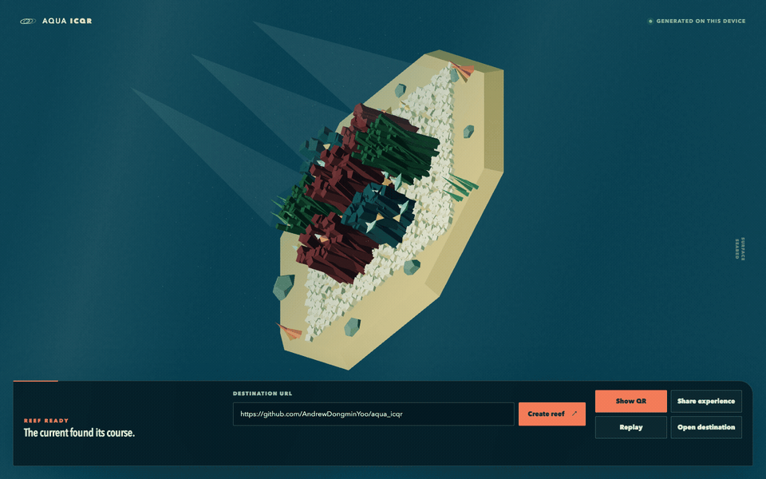

# Aqua ICQR

Aqua ICQR turns one destination URL into a shareable underwater QR experience.
The browser generates the QR code locally and connects it to a living low-poly coral garden.

This project is inspired by [tree.icqr.com](https://tree.icqr.com/).



## Run Locally

Aqua ICQR requires Node.js 22.12 or later and npm.

```bash
npm install
npm run dev
```

Open the local URL that Vite prints.
Enter an absolute HTTP or HTTPS destination, and then select `Create reef`.
Select `Show QR` or tap the reef to transform it into a QR code.
Select `View reef` to return to the diorama.

## Verification

Run all automated checks with this command:

```bash
npm run check
```

The command runs these gates:

1. Vitest unit tests for URL state, QR surface mapping, animation timing, and deterministic scene movement.
2. TypeScript checks and the Vite production build.
3. Playwright browser tests for creator, recipient, reduced-motion, invalid-input, WebGL fallback, and rendered QR decoding behavior.

The runtime gate decodes complete page screenshots, including the controls above the canvas.
It uses jsQR as an independent decoder and expects the exact destination URL.
The gate covers the 69-module boundary on 390 by 844 and 390 by 667 mobile viewports at CSS pixel resolution.
It also checks the expanded manual share field, fallback canvas bounds, and reduced-motion resize stability.
See the [verification record](docs/notes/2026-09-09-living-reef-verification.md) for observed results and remaining checks.
See the [active implementation plan](docs/plans/2026-09-09-living-reef-transition.md) for acceptance criteria and verification scope.

Automated decoding does not prove that every physical camera can scan the result.
A real-phone scan of the desktop result is a separate manual release gate and is currently `[PENDING]`.

## Sharing and Privacy

The application stores the destination in the share URL fragment as `#to=<encoded-destination>`.
Browsers do not send URL fragments in ordinary HTTP requests, so the destination does not enter normal server request logs through this mechanism.
The destination is still visible to anyone who receives or inspects the shared URL.

Aqua ICQR does not use an account, database, analytics service, or server-side short link.

## Architecture

The application uses Vite, TypeScript, Three.js, and qrcode without a component framework.

- `src/url-state.ts` validates destinations and owns the share fragment format.
- `src/qr-surface.ts` adds the QR quiet zone and converts modules into tile data.
- `src/reveal-timeline.ts` maps elapsed time to deterministic reveal progress.
- `src/scene-math.ts` calculates deterministic fish movement and reef module transforms.
- `src/aquarium-scene.ts` owns Three.js resources and renders the diorama.
- `src/main.ts` coordinates the DOM, sharing, animation, and fallback behavior.

The 3D scene uses one orthographic camera and instanced reef geometry.
The reef and QR views use the same colored modules.
The final frame keeps fish and atmospheric geometry outside the protected QR surface.
The renderer rejects source matrices larger than 69 modules on one side so narrow screens retain useful module density.

See the revised [v1 design](docs/plans/2026-09-09-aqua-icqr-v1-design.md) and [active implementation plan](docs/plans/2026-09-09-living-reef-transition.md) for the complete contract.

## Accessibility and Fallbacks

The application uses semantic controls, keyboard focus indicators, canvas descriptions, and polite live status messages.
It freezes scene motion and switches views immediately when the browser reports `prefers-reduced-motion: reduce`.
It renders a conventional 2D QR code when WebGL is unavailable or the active WebGL context is lost.
